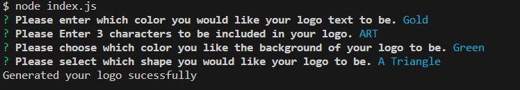
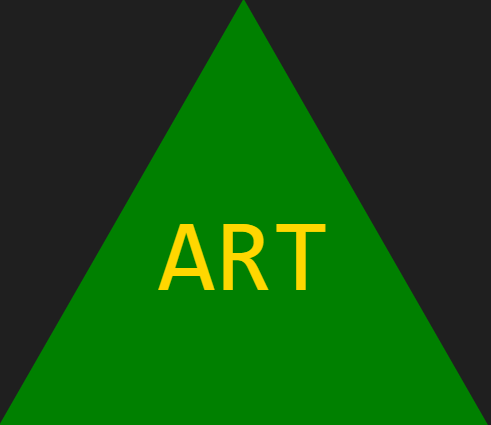
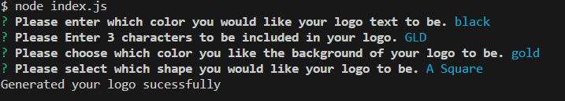
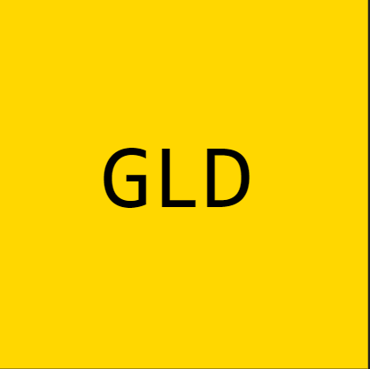
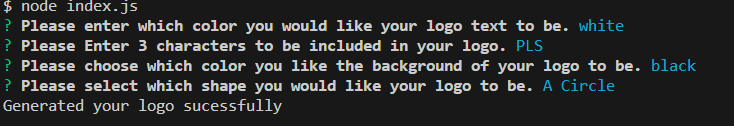
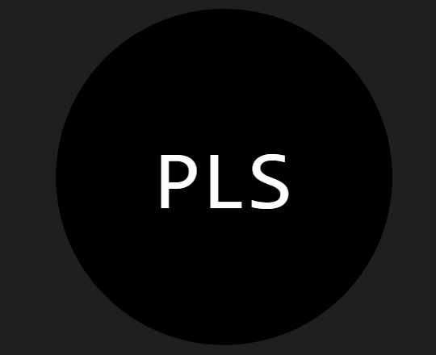

# OOP-SVG-Logo-Maker

# Quicklinks 

* [Description](#description)

* [Screenshot-of-the-application](#screenshot-of-the-application)

* [Screen-recording-of-the-functionality-of-the-app](#Screen-recording-of-the-functionality-of-the-app.)

* [Examples-of-generated-Logos](#examples-of-generated-logos)

* [Questions](#questions)

# User Story

```md
AS a freelance web developer
I WANT to generate a simple logo for my projects
SO THAT I don't have to pay a graphic designer
```

# Acceptance Criteria

```md
GIVEN a command-line application that accepts user input
WHEN I am prompted for text
THEN I can enter up to three characters
WHEN I am prompted for the text color
THEN I can enter a color keyword (OR a hexadecimal number)
WHEN I am prompted for a shape
THEN I am presented with a list of shapes to choose from: circle, triangle, and square
WHEN I am prompted for the shape's color
THEN I can enter a color keyword (OR a hexadecimal number)
WHEN I have entered input for all the prompts
THEN an SVG file is created named `logo.svg`
AND the output text "Generated logo.svg" is printed in the command line
WHEN I open the `logo.svg` file in a browser
THEN I am shown a 300x200 pixel image that matches the criteria I entered
```


# Description

This application was created to help developers create simple Logos for projects. It allows developers to make simple Logos without having to pay a graphic designer to create one. This application is tested with Jest, and includes 3 tests which test the fill value for each shape used.


# Screenshot of the application


# Screen recording of the functionality of the app.

Click on the link to watch a demo of the application ---->https://drive.google.com/file/d/1KHSObPWNfGzBLjfEZuVV3WWEFpH9MIe8/view

# Examples of generated Logos



















# Questions

Click the links below to reach out. 

Email: <a href="mailto:fergus.coding@gmail.com">fergus.coding@gmail.com</a>

[Link to my Github](https://github.com/Fergus-Codes)
